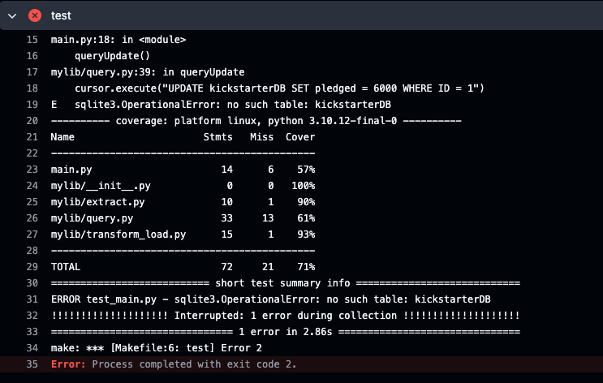
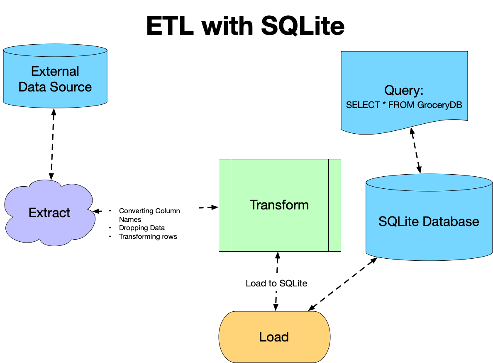

## Alex_Ackerman_Mini_Project_5_New

## Important Note

The original dataset intended to be used with this project contained Kickstarter project data. I had many issues getting the CICD build using this data despite everything working locally. I chose to keep my original code for this dataset for future investigation. The original code can be found commented out beneath the working code in each applicable script.

The error seen when using this data was:

After hours of trying to get the data to work I decided to switch to a different dataset and did not come across any issues. 

The remainder of this document pertains only to the working project code and dataset. 

## Purpose

The goal of this project was to build an Extract, Transform, Load (ETL) - Query pipeline. For this project I was required to perform Create, Read, Update, Delete (CRUD) Operations.

A visualization of the process is provided in the [sqlite-lab](https://github.com/nogibjj/sqlite-lab/tree/main) repo and can be seen below:

## Data

The data used for this project came from [RunCHIRON](https://github.com/RunCHIRON/dataset) and contains a csv file of the top Spotify songs from 2023

## References

- [sqlite-lab](https://github.com/nogibjj/sqlite-lab/tree/main)

- [Dataset from RunCHIRON Repo](https://github.com/RunCHIRON/dataset)